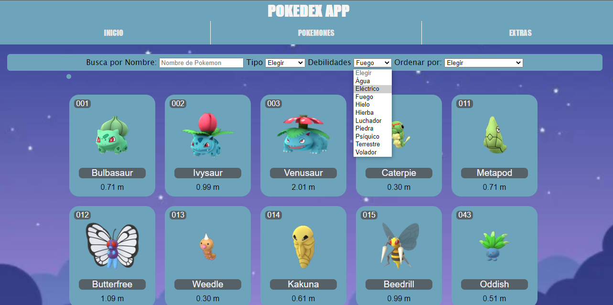
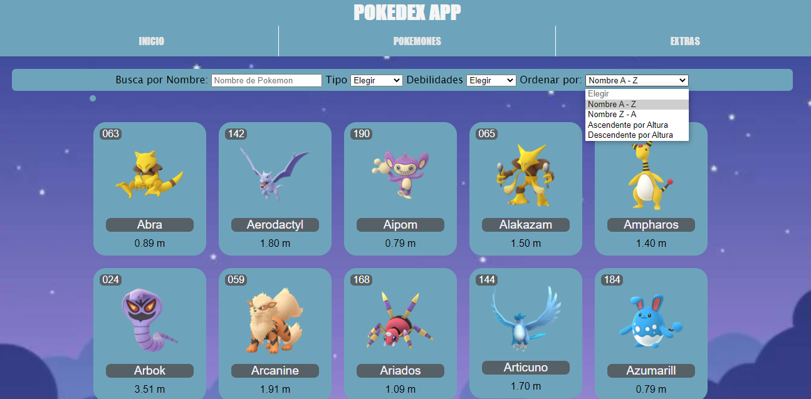
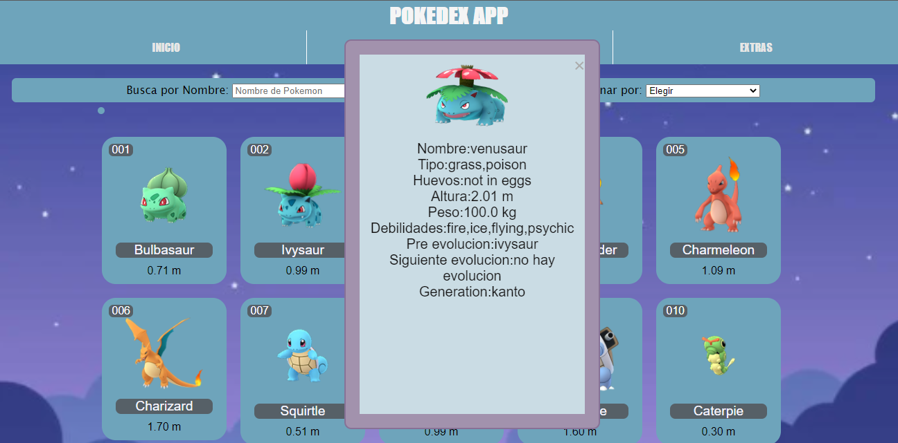
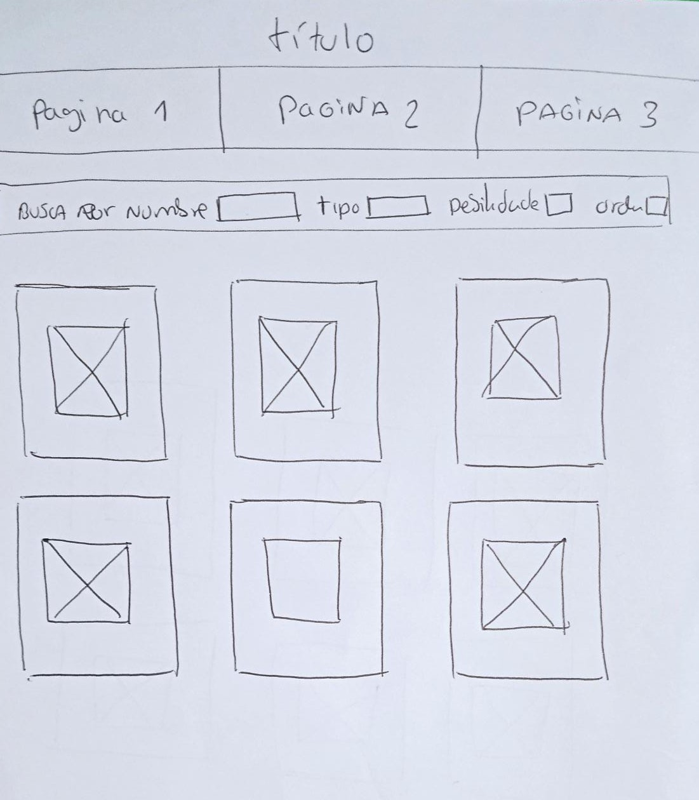
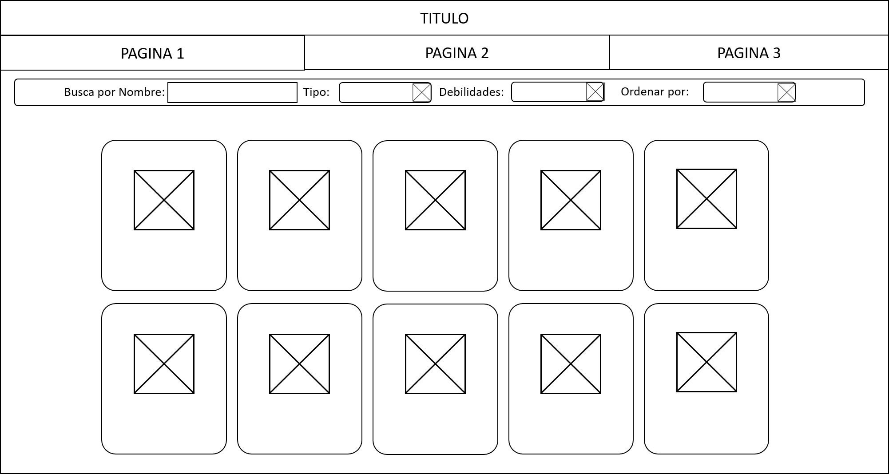
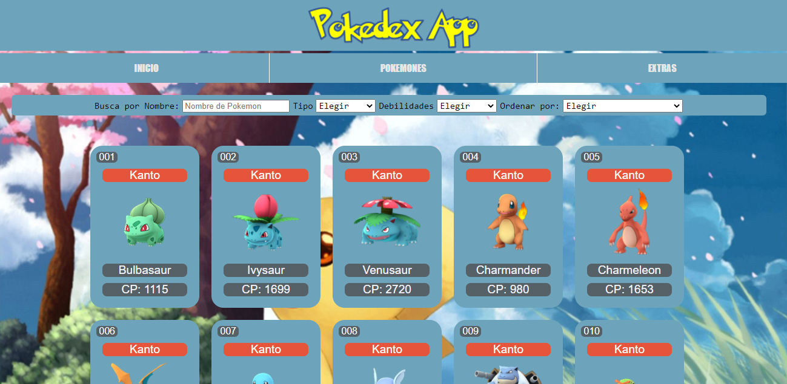
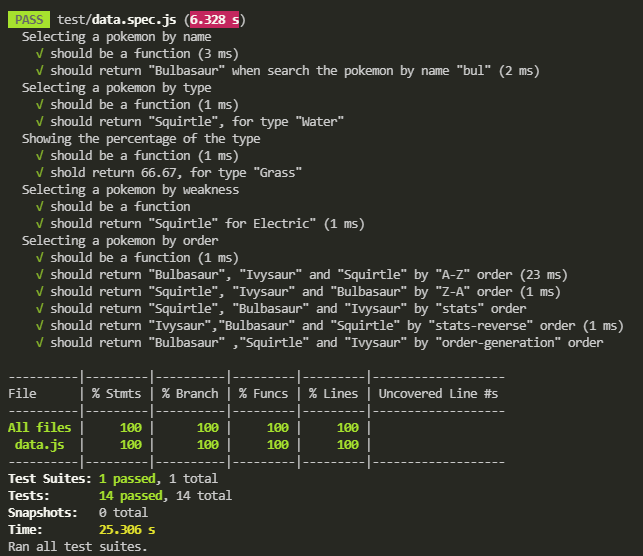

# POKEDEX APP

## Índice

* [1. Resumen del proyecto](#1-resumen-del-proyecto)
* [2. Consideraciones generales](#2-consideraciones-generales)
* [3. Historias de Usuario](#3-Historias-de-usuario)
* [4. Diseño de la Interfaz de Usuario](#4-Diseño-de-la-Interfaz-de-Usuario)
* [5. Pruebas unitarias](#5-Pruebas-unitarias)
* [6. Consideraciones técnicas](#7-consideraciones-técnicas)
* [7. Checklist](#8-checklist)

***
## 1. Resumen del proyecto

En la pagina web **POKEDEX APP** podras visualizar un
conjunto de datos de pokemon donde se encuentran 251 Pokemones de la región de Kanto y Johto.

Tambien podras visualizar la data,
filtrarla, ordenarla y hacer algún cálculo agregado.


## 2. Consideraciones generales

* Este proyecto se resolvio en duplas.
* Nuestro proyecto fue entregado subiendo nuestro código a GitHub (commit/push) a nuestros respectivos repositorios [Jackelin Gutierrez](https://github.com/JackelinGM/LIM015-data-lovers) y [Pamela Rupay](https://github.com/Alemapyapur/LIM015-data-lovers)
* Nuestra demo la pueden encontrar en [POKEDEX APP](https://pages.github.com/).
### Git y GitHub

* [X] [Uso de comandos de git (add | commit | pull | status | push)](https://github.com/jlord/git-it-electron)
* [X] Manejo de repositorios de GitHub (clone | fork | gh-pages)
* [X] Colaboración en Github (branches | pull requests | |[tags](https://git-scm.com/book/en/v2/Git-Basics-Tagging))

### UX

* [ ] Diseñar la aplicación pensando y entendiendo al usuario.
* [X] Crear prototipos para obtener feedback e iterar.
* [ ] Aplicar los principios de diseño visual (contraste, alineación, jerarquía)
* [X] Planear y ejecutar tests de usabilidad.


## 3. Historias de usuario

**Historias de Usuario 1**

- Un maestro pokemon quiere poder encontrar un pokemon por su nombre.

**Criterios de Aceptación**

- Se agrego un input en html donde se puede escribir el nombre del pokemon.
- Se Filtro un input para ver al pokemon al escribir su nombre

**Definición de Terminado**

- Se paso el test de la funcion filtrar name, para encontrar conincidencia con lo que se escribe.


**Historias de Usuario 2**

- Un maestro pokemon quiere poder encontrar un pokemon por su tipo.

**Criterios de Aceptación**

- Se agrego option en html donde se puede elegir el tipo del pokemon
- Se Filtro el option para ver al pokemon al elegir su tipo.

**Definición de Terminado**

- Se paso el test de la función filtrar tipo, para encontrar coincidencia con el tipo que se elige de pokemon.


**Historias de Usuario 3**

- Un maestro pokemon quiere poder encontrar un pokemon por su debilidad.

**Criterios de Aceptación**

- Se agrego option en html donde se puede elegir el tipo de debilidad del pokemon.
- Se Filtro el option para ver al pokemon al elegir su tipo de debilidad.

**Definición de Terminado**

- Se paso el test de la función filtrar tipo de debilidad, para encontrar coincidencia con el tipo que se elige de pokemon.



**Historias de Usuario 4**

- Un maestro pokemon quiere poder encontrar los pokemones en forma ascendente y descendente por su nombre, tambien de forma ascendente y descendente por su poder.

**Criterios de Aceptación**

- Se agrego option en html donde se puede elegir la opcion en forma asecente y decente del pokemon.
- Se Filtro el option para ordenar y ver al pokemon al elegir su opcion.

**Definición de Terminado**

- Se paso el test de la función filtrar ordenar, para encontrar coincidencia con la opcion que se elige de pokemon.




**Historias de Usuario 5**
- Un maestro pokemon quiere poder encontrar los datos del pokemon.

**Criterios de Aceptación**
- Se realizo un modal en html donde aparece un card con el pokemon elegido y sus datos especificos.

**Definición de Terminado**
- Se logra que aparezca el card al dar click al pokemon elegido con su informacion.




## 4. Diseño de la Interfaz de Usuario

#### Prototipo de baja fidelidad



#### Testeos de usabilidad




#### Prototipo de alta fidelidad


#### Prototipo final




### Implementación de la Interfaz de Usuario (HTML/CSS/JS)

Nuestra pagina web **POKEDEX APP**:

1. Muestra la data en una interfaz en card.
2. Permite al usuario interactuar para obtener la infomación que necesita.
3. Es _responsive_, es decir, se puede visualizar sin problemas desde distintos
   tamaños de pantallas: móviles, tablets y desktops.


## 5. Pruebas unitarias

Se realizo funciones encargadas de  _procesar_,
_filtrar_ y _ordenar_ la data, así como _calcular_.

Las _pruebas unitarias_ nos dan una cobertura del 100% de _statements_
(_sentencias_), _functions_ (_funciones_), _lines_ (_líneas_), y _branches_
(_ramas_) del archivo `src/data.js`.



## 6. Consideraciones técnicas

El _boilerplate_ contiene una estructura de archivos como punto de partida así
como toda la configuración de dependencias:

```text
.
├── EXTRA.md
├── README.md
├── package.json
├── src
|  ├── img
|  ├── data (según con qué data trabajes)
|  |  ├── pokemon
|  |  |  ├── pokemon.js
|  |  |  ├── pokemon.json
|  |  |  └── README.md
|  ├── data.js
|  ├── index.html
|  ├── inicio.html
|  ├── main.js
|  └── style.css
└── test
   └── data.spec.js

directory: 6 file: 17
```


## 7. Checklist

* [ ] Usa VanillaJS.
* [X] No hace uso de `this`.
* [ ] Pasa linter (`npm run pretest`)
* [X] Pasa tests (`npm test`)
* [X] Pruebas unitarias cubren un mínimo del 70% de statements, functions y
  lines y branches.
* [ ] Incluye un _plan de acción_ de tus objetivos de aprendizaje prioritizado en `README.md` (o otro archivo).
* [X] Incluye _Definición del producto_ clara e informativa en `README.md`.
* [X] Incluye historias de usuario en `README.md`.
* [X] Incluye _sketch_ de la solución (prototipo de baja fidelidad) en
  `README.md`.
* [X] Incluye _Diseño de la Interfaz de Usuario_ (prototipo de alta fidelidad)
  en `README.md`.
* [ ] Incluye link a Zeplin en `README.md`.
* [ ] Incluye el listado de problemas que detectaste a través de tests de
  usabilidad en el `README.md`.
* [ ] UI: Muestra lista y/o tabla con datos y/o indicadores.
* [X] UI: Permite ordenar data por uno o más campos (asc y desc).
* [X] UI: Permite filtrar data en base a una condición.
* [ ] UI: Es _responsive_.

### Proyecto elaborado en dupla por:
* [Jackeline Gutierrez](https://github.com/JackelinGM)
* [Pamela Rupay](https://github.com/Alemapyapur)